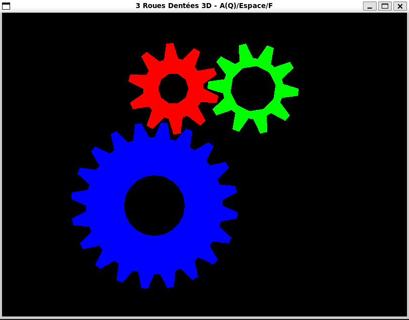
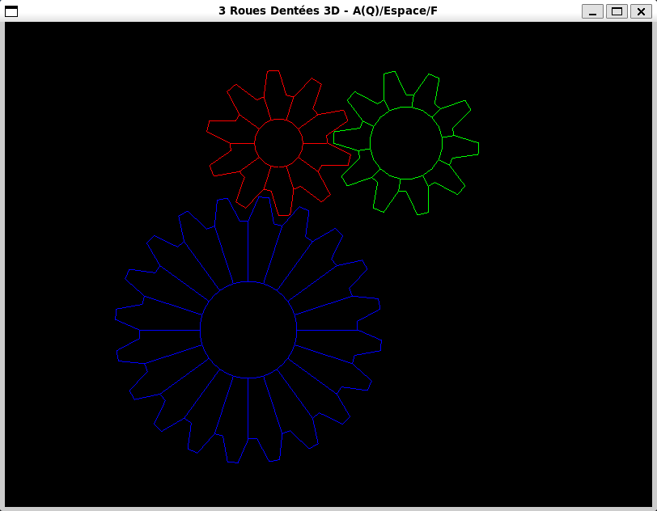

# ⚙️ 3D Gears Simulation – OpenGL / C++

This project is an **interactive 3D simulation of mechanical gears**, developed in **C++ using OpenGL and GLFW**.  
It visualizes **three interlocking gears** with different sizes, thicknesses, and rotation ratios, reproducing a realistic mechanical behavior.

---
## 📸 Screenshots

<p align="center">
  
  
</p>

---

## ✨ Features

* 🔴 **Red Gear**

  * Reference gear
* 🟢 **Green Gear**

  * Same radius and number of teeth as the red gear
  * Larger central hole
  * Thicker body
* 🔵 **Blue Gear**

  * Radius ×2
  * Number of teeth ×2
  * Thinner body
  * Positioned below the red gear
* ⚙️ **Realistic mechanical rotation**

  * Opposite rotation directions
  * Rotation speed based on gear ratio
* 🎮 **Interactive keyboard controls**
* 🧱 Full **3D geometry**

  * Front face
  * Back face
  * Side facets (true thickness)

---

## 🎮 Keyboard Controls

| Key                        | Action                          |
| -------------------------- | ------------------------------- |
| **A** (or **Q** on AZERTY) | Toggle continuous animation     |
| **Space**                  | Step-by-step rotation           |
| **F**                      | Toggle wireframe / filled faces |
| **Esc**                    | Exit application                |

---

## 🧩 Technologies Used

* **Language**: C++17
* **Graphics API**: OpenGL (fixed pipeline)
* **Window & input handling**: GLFW
* **Build system**: Makefile / g++

---

## 📁 Project Structure

```
3D-Gears-OpenGL/
 ├── main.cpp
 ├── Makefile
 └── README.md
```

---

## ⚙️ Requirements

### Linux (Debian / Ubuntu)

```bash
sudo apt update
sudo apt install libglfw3-dev libgl1-mesa-dev
```

---

## 🛠️ Build & Run

### Compile

```bash
make all
```

### Run

```bash
./3D-Gears
```

### Clean build files

```bash
make clean all
```

---

## 🧠 Technical Details

* Each gear is implemented using a **`Roue` class**
* Teeth are built from **geometric blocks**
* Side facets provide real **3D depth**
* Rotation synchronization follows:

```
angular_speed ∝ 1 / number_of_teeth
```

---

## 📸 Expected Output

* Three colored 3D gears
* Smooth animation
* Interactive controls
* Correct mechanical engagement

---

## 🚀 Possible Improvements

* Lighting (Phong / Gouraud)
* Camera controls (zoom, rotation)
* Textures
* Modern OpenGL (VBO / VAO / shaders)
* Export to STL / OBJ

---

## 👤 Authors

**Abdelhakim NAHILI & Walid KESBI**  
🎓 Computer Graphics  
📚 Academic OpenGL project  
@2026  

---

## 📄 License

This project is licensed under the **MIT License** – see the `LICENSE` file for details.
